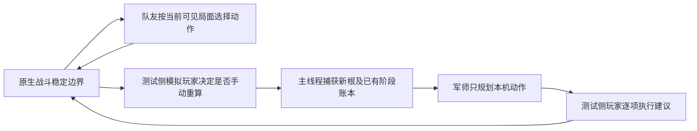

# 多人实验设计：交错行动与手动重算（2026-09-23）

[策略索引](../README.md) · [当前结果归档](../multiplayer-shared-damage-20260923/closeout.md) · [协议草案](protocol.json) · [现役多人指南](../../multiplayer-advisor.md)

状态：设计完成，执行器、原根清单和新实验尚未实现或运行。当前行为仍为 `fd976376 / 0.44.2`；本方案不调整评分、不增加生产预算、不预测队友主动行为，也不启动可见 Steam。协议里的批次数是计划运行数，不能计入已通过测试。

## 1. 要回答的问题

核心问题是：**在不知道队友下一步的情况下，玩家按某种手动重算节奏使用军师，整场结果是否比基线好，哪些队友与局面会使它变差？**

先比较同一份实现中共享伤害信用关闭/开启，隔离这一项的作用。原型队友死亡折价、威胁压力等若以后重试，各自新增单因素实验，不与当前信用改动打包解释。0.44.1旧DLL只作另外标明版本差异的历史校准，不能混称“唯一差异为一个开关”。

三种结论必须分开：

| 证据 | 回答什么 | 不能回答什么 |
| --- | --- | --- |
| 原生/模拟严格差分 | 同根、同动作的结算与状态是否一致 | 队友像不像真人、建议是否普遍更好 |
| 原生动作驱动的受控闭环 | 对指定完整牌组、队友策略和重算节奏，建议如何影响后续结果 | 真人分布、真实网络与可见性能 |
| 独立真人操作记录和后续配对试用 | 合成队友遗漏哪些行为；建议在这些真人场景中的表现 | 未覆盖人群、角色或遭遇的保证 |

现有71次变体搜索属于首轮建议加固定续行的敏感性实验，结论和限制已归[实施记录](../multiplayer-shared-damage-20260923/implementation.md)。下一轮增加的价值首先是反馈过程和原生环境，而不是运行次数。

## 2. 一场实验怎样推进

这里的“闭环”属于测试编排。游戏里的军师继续只接受手动请求，不自动操作；队友策略、调度表及其随机数都不传给 Search。

1. 从登记的战前完整全队状态建局，保留角色、整副牌、升级、遗物、药水、HP与原生多人血量缩放。先核对恢复后的全队状态与身份；合成极端夹具另列为压力测试。
2. 调度器在一项原生动作及其选牌/死亡/触发链全部结束后选择下一个行动者，不在事务中途切人。
3. 轮到队友时，其策略依据**当前**局面重新选择合法动作；不会照搬另一版本轨迹上的动作。爆发、击杀和本机防守都可以反过来改变队友选择。
4. 轮到本机时，测试侧按预定节奏模拟“重新计算”按钮。沿现有等待旧搜索退出、稳定根捕获与结果接收流程；一场战斗内不重置 `SolverCombatSession`，阶段截止和已观察贡献持续保留。
5. 将建议逐项映射到原生牌实例、目标和选择，通过原生动作入口执行。一个建议可以被队友动作打断；继续使用还是重算由登记的玩家节奏决定，不事后挑更有利的方式。
6. 直到原生团队终局或明确实验上限。本机死亡后仍让活着的队友行动；复活后恢复本机驱动，不把本机死亡直接写成全队战败。

质量批次先在搜索期间暂停测试世界推进，使计算快慢不暗中决定队友先后。另设正确性压力批次，在搜索运行时注入一个已登记的队友动作并检查旧根冻结、结果过期、取消及再次捕获。这两类数据不合并成性能或联机延迟结论。

## 3. 队友的“未知”怎样表示

不试图发明一个“典型玩家概率”。先覆盖有意义的行为范围，最后用独立真人记录校准哪些组合常见。每个策略只能看已登记的信息视图：自己的手牌/资源、公开敌方意图、全队公开状态和过去已发生事件；不能读牌堆顺序、未来RNG、军师候选或另一实验臂的结果。他人手牌是否可见需按游戏/界面事实另行登记，初版不使用。

| 策略族 | 状态变化后的响应 | 主要检验风险 |
| --- | --- | --- |
| 即时进攻 | 优先可见的即时击杀机会，再压血；目标死亡后换目标 | 队友提前击杀导致本机毒/能力投资来不及回本 |
| 生存优先 | 随当前受击意图、已有格挡和自身HP改变防御投入，余力进攻 | 闲置假设下夸大的队友死亡风险、双方防御重复 |
| 蓄力后爆发 | 有安全窗口时准备能力/资源，随后转进攻 | 历史平均输出不能代表下一回合，长期投资排序 |
| 团队支援 | 依据队友当下风险选择已验证的格挡、治疗或支援目标 | 本机与队友防守耦合；不把未支持效果伪装成成功 |
| 状态切换 | HP低时防守，机会出现时转火/爆发，条件改变后重新选牌 | 一个固定策略标签不能覆盖整场行为 |
| 有限失误 | 从基准策略的合法候选中偶尔选择次优动作、延后或提前ready | 对非最优队友的敏感性；失误概率是压力参数，未经校准不称真人概率 |

队友策略使用独立、可解释的优先级与当前牌面/资源信息，不调用被测军师替自己选最优路线，不复用它的共享伤害评分。策略实现和参数在比较前冻结；全随机合法出牌、长时间闲置单列为负哨兵，不混入“平均玩家”成绩。

多样性还包括整副牌组、职业组合、敌人机制、药水和行动节奏。多个种子若只给同一副三张牌换顺序，不能代替这些维度。完整牌组允许消耗、洗牌、抽弃、跨回合投资和资源耗尽自然发生；禁止每周期补牌、补能量或补血维持脚本。

## 4. 行动顺序与玩家重算节奏

首批采用两个调度条件：

- `peer_batch_first`：队友先完成本轮可行动批次，再由本机操作，作为顺序边界。
- `alternate_one_action`：双方每次完成一项稳定动作后交替；某方ready、死亡或没有合法动作时按原生资格处理。额外玩家回合按真实资格推进，不凭敌方周期号伪造参与者。

后续再加队友晚爆发、多队友交错、随机批次长度、ready后撤销。随机调度必须记录实际顺序，保证可行动者不会永久饥饿；不凭空给予额外玩家回合。

首批采用两个玩家节奏：

- `turn_start`：每个本机玩家回合首次操作前请求一次；队友插入动作后，尚合法的旧建议可以继续使用，保留其过期状态。
- `after_peer_batch`：除回合首次请求外，队友批次结束、即将再次轮到本机时重新请求。

队友全部先行动完时，两种节奏在本机首次操作前合并为同一次请求；没有额外信息时不得再发第二次。首批因此只登记三个有效组合：先行动完/回合首次、逐牌交错/回合首次、逐牌交错/队友批次后。后续比较同样先去掉行为相同的组合，不做无意义的全因素重复。

两者遇到建议中的牌/目标/选择已不合法时，都记录 `advice_invalid`、中止旧路线，并模拟一次额外手动重算；不得偷偷换成“同名另一张牌”、替换目标或跳过该步继续。额外请求计入成本与上限。如果仍无建议、缺少选择适配或明确未支持，首批停止该臂并记录原因，不用默认防御掩盖失败。未来要研究“没建议时玩家自己打”须预先登记独立回退策略。

这些节奏是操作模型，不是对真人频率的测量。不能把频繁重算所得收益直接归给每回合只看一次建议的使用方式。

## 5. 同根比较与随机性

配对键为 `原根 × 队友策略/参数 × 调度 × 重算节奏 × 外部随机种子`，每个键都有关闭/开启两臂。两臂从相同全队状态、历史、阶段起点和九条游戏RNG状态开始，使用同样的固定请求预算；顺序交错，避免机器负载只影响某一臂。触及时间上限时单列，不能继续称完全相同的工作量。

游戏自身RNG按真实动作自然消耗。一臂多抽牌或少杀一个怪后，后续RNG位置可能不同，这是动作的后果，不能强行拉齐计数或喂给它另一臂的随机结果。队友决策和调度另用测试专属随机源，不能消耗游戏RNG；按配对键、玩家稳定身份、玩家回合及该玩家决策序号取值，缺少某次决策时不消耗其他玩家的流。动作与合法集合不同仍可能产生不同选择，不承诺分叉后逐步相同。

录制真人的动作带只适合原路径重放校验。改变本机动作后，队友原目标可能已死、资源或手牌不同；不能继续原动作带再把非法动作删掉。反事实比较应重新运行冻结的反馈策略，真人动作带用于校准该策略和发现遗漏，不能给出未观察到的真人反事实。

## 6. 什么算好，什么算未知

主表按以下顺序并列报告，不合成一个自证的新评分：

1. **可用性与真实团队终局**：完整胜/败、没有建议、未支持、恢复差异、异常、超时与截断分别计数；本机与每位队友死亡、复活及发生周期另列。
2. **生命代价**：逐玩家累计实际扣血、治疗、最大HP损失和结束HP。双方都完成且获胜的配对再比较本机/全队战损，并明确这个条件子集；不把较早战败带来的少扣血当收益。
3. **资源与负担**：逐玩家药水种类/数量、请求次数、失效建议、实际搜索工作量；结束周期只作次级信息，不用更快击杀替代更低战损。
4. **负面个案**：列出所有候选独有的战败/死亡/不可用原因，以及战损恶化最大的原根。小样本先报最坏个案，样本足够后才估计尾部分位数。

停止结果必须显式分类：原生 `team_win` / `team_loss`；`cycle_limit` / `decision_limit` / `query_limit` / `request_timeout`；`unsupported` / `no_advice` / `choice_adapter_missing` / `root_mismatch` / `execution_error`。截断行保留最后观察状态，但不伪造最终战损。某一臂失败的配对仍留在总分母和可用性表；只有双臂均可比的结果进入相应条件指标，并报告移除原因及最保守/乐观界限。

独立抽样单位优先为原始跑局/来源牌组集群。同一跑局多个检查点、换HP、换种子、换脚本都在同一个集群下；如果几个来源其实是同一生成模板，也另报模板层敏感性。先在根内汇总登记的环境条件，再按独立根等权比较。正式区间以集群为单位重采样，保留成对结构；四个原根的试跑不计算足以支撑推广的置信度。

开发集可定位问题；验证集用于选择预先列明的候选；最终留出集按原始跑局、牌组来源及队友策略族划分，不能只换种子。看过留出结果再调参后，该集就成为开发数据，下一轮需要新的留出。未知真实队友分布时，先给各策略族/重算节奏分层结果及权重敏感性，不用未经校准的混合权重宣称总胜率。

## 7. 分批实施与停止门槛

| 批次 | 具体产物与规模 | 通过后才做什么 |
| --- | --- | --- |
| A：闭环能力 | 一份双人完整牌组根、原生双方各一动作、两次真实手动请求及下一玩家回合；查全队状态、根冻结、阶段账本、请求归属和零自动部署。另用最小夹具检查搜索中队友行动/ready撤销，不混进质量指标。 | 明确新根来自推进后的原生状态，才开放多轨迹。 |
| B：协议试跑 | 4个独立来源的双人完整根 × 2队友族（进攻/生存）× 3个有效调度/重算组合 × 2评分臂 = **48条轨迹、24对、至多4个独立原根**。目标覆盖毒与即时击杀、防御、投资、多敌转火；具体根尚待登记。 | 只验执行器、输出口径和故障覆盖，不宣布联机质量改善。 |
| C：冻结质量比较 | 根据B中的根间方差和预先约定的最小有用差异确定样本量与停止规则；加入6类队友、正常/精英/首领与多种完整角色组合。先完成三/四人资格与全队恢复合同再加入对应分层。 | 只为通过语义门槛的声明范围作有区间的结论；不靠不断加样本等到“显著”。 |
| D：真人校准 | 在另行明确收集范围后，使用完整且来源独立的多人动作/手动重算记录；比对行为分布、转火、防守过量、蓄力时点、ready撤销和失效建议。随后做冻结版本配对试用。 | 才讨论这些真人样本中的外部一致性；录制和联机运行尚未执行。 |

B的每次搜索暂沿用 `Beam12 / 350节点 / 3000ms / DOP1 / H14` 固定预算，保持与前轮可比较；这不是面向普通预设的普遍质量结论。每条轨迹总上限120秒、12个敌方周期、256个稳定决策、24次手动请求；任何一个上限先到就记录对应截断。选择能在上限内结束的短战斗作协议试跑，若长战斗频繁截断，应另设计批次，不能在同一轮将失败请求超时延长到180/360秒。搜索十四周期上限与外部实际推进上限是两个独立量。

首批明确的成功条件是：所有登记配对均有两臂记录；实际走过交错和重算；无伪造终局/默认跳过；首次差异可定位到状态、动作或建议；遇到有意未支持边界能准确分类。质量不作为框架试跑的通过条件。C的效果阈值、原根数量及留出清单在B后登记，不能在未确定数据方差与覆盖前承诺“几百场足够”。

## 8. 现有代码能复用什么、缺什么

以下是设计落点，不宣称已有新接口；没有迁移当前生产职责。

| 当前入口 | 可复用 | 必须补齐/限制 |
| --- | --- | --- |
| [OfflineCombat](../../../tools/OfflineSearchHarness/OfflineCombat.cs) | 原生对象图、房间和玩家回合启动 | 当前多人合同只创建两名同角色玩家，经单人传输启动；需明确全队配置、原生人数缩放及每轨迹完整复位，不能称真实网络。 |
| [MultiplayerStartContracts](../../../tools/OfflineSearchHarness/MultiplayerStartContracts.cs) | 实际按钮与 `RequestSearch`、等待队列、主/客本机身份合同 | 目前有渲染/传输/录像替身，只证明启动边界。需可重复调用的测试会话驱动、建议读取和严格动作匹配；一次战斗内只Begin一次。 |
| [CombatRootSnapshot](../../../src/Runtime/CombatRootSnapshot.cs) | 主线程稳定根与全队冻结；已有观察账本 | `Capture`读取live战斗，没有可直接给任意影子状态重新建根的现成协议。首版从原生环境重捕获，不对未推进的live对象“重算”。 |
| [ScenarioBuilder](../../../src/Testing/UnattendedTestRunner.ScenarioBuilder.cs) 与[原生共享伤害合同](../../../src/Testing/UnattendedTestRunner.MultiplayerSharedDamage.cs) | 无头原生双方模型、完整状态差分、下一回合和ready撤销 | 当前为专项双人夹具；需要独立多人实验请求、逐玩家选择/动作驱动和真实团队结束判定。不能复用单人自动部署作为多人行为。 |
| [随机场景](../../GENERATED_COMBAT_SCENARIOS.md) | 可参考配置、来源记录与固定种子方法 | 当前明确限定单人并拒绝多人专用内容，不能直接在这个入口塞多人配置或把输出当多人样本。 |
| [检查点恢复](../../CHECKPOINT_REPLAY.md) | 完整原生状态、历史、政策与恢复证明的口径 | 通用恢复资料不等于已验证完整多人恢复；须补本机身份、全队牌堆/历史/阶段及原生编码的恢复合同。`Preflight`不计恢复成功。 |
| [录像观察器](../../../src/Runtime/CombatReplayRecording.cs) | 原生事件、战斗开始/结束、搜索结果测试观察 | 补实验行的配对键、策略/调度/重算原因；不能从只有汇总HP的旧日志补造队友行为。 |

新编排放在 `tools/OfflineSearchHarness/`，需要原生无头接入时遵守 `src/Testing` 的 ScenarioBuilder / Executor / Assertions / Writer 分工。队友策略、调度器和记录器归测试侧，不进入 `SimulatedCombatState` 或生产评分。现有 `RACE_VARIANT` 只接旧外评；新原生闭环需要**仅测试请求**的0/1消融接线，并验证两臂只有该评分因素不同，生产默认不变。

普通.NET试跑可先复用托管原生对象图，但要明确它与真正Godot无头仍有环境差异。首个闭环合同必须在原生无头宿主中通过；以后只选穿过新边界的代表做差分，不要求每个策略样本都重复严格回放。多人网络、可见时延与真人输入仍在此之外。

每条轨迹重建完整战斗和会话；无头进程可在一批内复用，前提是已验证清空前次Run/静态测试钩子/账本且下一根恢复一致。未建立复位合同前采用独立宿主进程。重新编译后退出旧DLL进程，最后一项用既有清理开关删除仓库内无头实例。新增请求/脚本参数时同步Bash和PowerShell；本方案未新增可执行命令。

## 9. 记录格式与复核入口

[protocol.json](protocol.json)登记比较因素、试跑规模、上限和状态枚举，当前 `readyToExecute=false`。实施后另写具体root manifest并冻结其来源，不把这份草案直接传给现有无人测试CLI。

- 运行清单：执行器与求解器来源、游戏/Mod环境、原根/集群ID、完整全队装备与状态、九条RNG起点、预算、队友策略版本、调度/玩家节奏、外部随机种子、留出分组。
- 逐事件：原生动作与选择、行动者、敌方周期和各玩家回合、稳定牌实例/目标、前后状态戳与RNG计数变化；手动请求原因、对应根、建议和实际执行前缀、失效/取消原因。
- 配对汇总：原生团队终局或明确停止原因、逐玩家扣血/治疗/最大HP/死亡/复活/药水、搜索工作量、请求次数、执行动作数、失败/截断及可比范围。

完整日志留在任务 `.local/`，将冻结输入描述、精简配对表和真实验证凭证归入专题文档与测试矩阵。发现模拟差异先转战斗语义修复；只发现策略差异才进入评分/保路实验。固定首轮敏感性测试继续保留其用途，不因新闭环出现而删除历史证据。

## 10. 方法来源与采用范围

- Carroll等人的[人类与AI协作研究](https://arxiv.org/abs/1910.05789)观察到，与自己或同类策略配合好的智能体不一定适合人类伙伴。本方案据此采用独立队友族和真人校准；这是对实验方法的借鉴，论文的Overcooked结果不能证明CombatSolver收益，也不构成在生产搜索里预测队友的授权。
- Agarwal等人的[统计评估研究](https://arxiv.org/abs/2108.13264)强调少量运行下单一均值可能掩盖不确定性，主张区间和分布化报告。本方案据此并列逐根配对、恶化个案及集群区间；以原始跑局为集群是本项目针对相关样本的设计，不是该论文对本游戏给出的样本量结论。

本轮通过原论文摘要页核对题名、作者与上述研究结论；没有下载整篇论文复核实验细节。主要设计依据仍是当前代码的真实入口、前轮证据限制和多人手动军师边界。

本次L0核对8个改动文件涉及的611个本地链接、57个锚点、JSON和来源元数据，通过；三个有效交互组合的计数为24对/48条计划轨迹，实际执行数为0。凭证位于 `.local/neat-multiplayer-20260923/experiment-design-l0.json`。未运行新的游戏测试、构建或打包。
