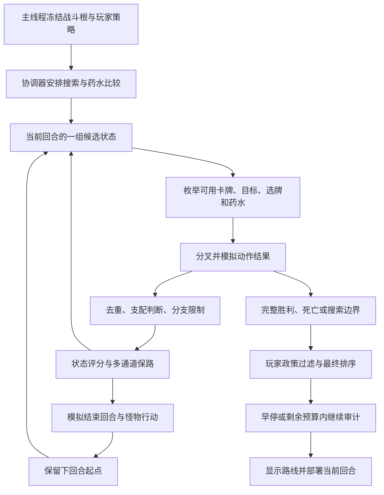

# 当前搜索逻辑详解：评分、保路、剪枝与最终选路

本文回答：求解器怎样想下一步，怎样评价一张牌，为什么留下某条路线，以及为什么明明存在更好的打法却可能搜不到。

**审阅日期：2026-09-12。分支：`feat/act3-boss-strategy`。已提交快照：`3b6f9c1`，最近的行为提交为 `de685ec`。** 这是以已发布 0.36.4 为基线继续开发后的源码说明，不能直接当作 0.36.4 的发布功能清单。文末单独列出工作区尚未提交的神化实验。

本轮按用户要求停止算法修改，只阅读源码、收束已经启动的诊断并编写文档。本文是带日期的实现快照；后续代码变化以源码和[架构地图](../ARCHITECTURE.md)为准。源码链接指向仓库文件，方法名是定位锚点，避免后续行号变化造成误解。

## 1. 先把四种“评分”分清楚

| 判断层 | 它回答什么 | 主要依据 | 不能代表什么 |
|---|---|---|---|
| 选牌估值 `CardValue` / `RemovalPriority` | 选牌窗口里先尝试拿哪张、烧哪张 | 基础伤害、格挡、抽牌、牌类别及少量移除修正 | 这张牌在完整卡组中的真实强度 |
| 状态基础分 `Snapshot.Score` | 做完动作后，这个局面眼下看起来怎样 | 预计承伤后的 HP、敌方 HP、累计扣血、策略收益等 | 整场最终战损 |
| 中途排名 `BeamRankScore` 与保路 | 预算有限，哪些中间局面值得继续搜 | 基础分加持续效果、费用、未来资源，再加多样性通道 | 最终必须选择的路线 |
| 完整路线排序 `FinalPlanOrdering` | 已经搜出的路线里采用哪条 | 胜负、存活、玩家政策、战略战损、目标完成、回合等逐项比较 | 所有合法路线中的全局最优解 |

**当前不是“每张牌打个分，然后从高到低打牌”。** 求解器会分叉状态，真实模拟不同顺序、目标和选牌；但是分支太多，只能保留一部分。因此，模拟准确、最后选路规则正确，也仍可能因为中途剪枝而错失好路线。

“最终喜欢低战损”和“搜索过程中敢于卖血启动”是两件事。前者只有在完整路线真的被搜出来后才能发挥作用。

## 2. 一次计算从哪里开始

主线程在稳定时点捕获 `CombatRootSnapshot`，同时冻结 `SearchPolicySnapshot`。后台接收的内容包括战斗状态、牌堆与顺序、费用、Power、怪物状态、遗物计数、药水、RNG，以及本次玩家策略和预算。

后台不能一边算一边读取实机正在变化的手牌和血量；每个分支拥有自己的模拟状态。打牌、怪物行动、抽牌和选牌都在这些分支里推进。真实游戏只在采用路线后，通过原版入口执行当前回合动作。



源码：[搜索根](../../src/Runtime/CombatRootSnapshot.cs)、[政策快照](../../src/Search/SearchPolicySnapshot.cs)、[协调器](../../src/Search/CombatSearchCoordinator.cs)、[搜索阶段](../../src/Search/CombatBeamSolver.Phases.cs)。

## 3. 搜索树怎样长出来

### 3.1 一个节点是什么

节点表示“从搜索根执行了一串动作后的状态”，同时保留父节点、动作、回合、用药历史、累计主动卖血、路线特征和模拟快照。父链用于恢复完整动作序列，也用于识别开局谱系、循环和某些选牌分支。

这里有三种数量，不能混用：

- **展开节点**：选中一个状态，尝试向外生成动作。
- **状态转移**：具体模拟一次卡牌、药水或回合推进等操作。
- **选牌分支**：一次动作内部遇到选牌时尝试的不同选择。

一个节点可能产生很多次状态转移；“查阅世界线”也不能理解为已经完整打完同样数量的战斗。

### 3.2 动作不是只看静态分生成

对当前手牌检查分支状态下实际能否打出，再枚举合法目标。语义相同的可打实例有去重，特殊实例差异必须保留在身份中。药水还要通过可用性、模拟支持、保护/强制指令及用药额度等检查。

模拟会处理抽牌、回能、降费、消耗和嵌套选牌。因而理论上可以出现“先打几张低费牌，让后面的高费牌变成零费”这样的顺序，而不必预先写一条牌序脚本。

**能生成不等于能保留，保留也不等于已经展开。** 一个动作合法，但仍可能在单节点分支上限、全局排名、后续回合保路或预算处消失。

### 3.3 选牌窗口怎样分支

手牌选择和牌堆选择有不同的数量上限。取牌、置顶、本回合免费等单卡路由选择会扩大到覆盖可选项的限额；并非所有选牌都统一只取前几个。多卡组合与嵌套窗口还会受到选择回放预算约束。

弃牌、弃后抽、消耗、转变通常按移除估值从低到高尝试；获取等选择按卡牌估值从高到低尝试。同值还涉及语义身份和确定性顺序。后续保路又会为不同选牌选项建立代表，减少单个选项独占队列。

源码：[候选展开](../../src/Search/CombatBeamSolver.Expansion.cs)、[选牌支持](../../src/Search/CardChoiceSupport.cs)、[首层选牌回放](../../src/Search/CombatBeamSolver.PrimaryChoiceReplay.cs)。

## 4. 卡牌评分：现在确实比较粗

### 4.1 通用公式

`CardChoiceSupport.CardValue` 当前是：

```text
卡牌估值 = Damage 基础变量
         + Block 基础变量 × 0.8
         + Cards 基础变量 × 3
         +（能力牌 ? 8 : 0）
```

读取的是对应动态变量的 `BaseValue`。没有该变量就贡献 0。它不是结算后的伤害，不统一除以费用，也不自动展开所有联动。

例如，只有 6 基础伤害的牌得到 6；只有 5 基础格挡得到 4；只有 2 张抽牌得到 6；没有上述数值的能力牌得到 8。这些只是公式示例，不是游戏内完整价值比较。

这解释了一个明显局限：一张启动核心若没有直接数值，它的静态估值可能并不突出；而一张即时伤害高的牌更容易在这里占优势。神化也不能仅靠这条公式获得“升级整副牌”的完整价值。

### 4.2 消耗和转变的修正

`RemovalPriority` 越低，越先尝试移除。当前内置修正包括：

| 对象 | 消耗/转变时使用的估值 |
|---|---|
| 五职业原版起手打击 | 基础伤害 × 2/3 |
| 五职业原版起手防御 | 基础格挡 × 1.2 |
| 有第三方移除偏置登记的卡牌 | 通用估值 + 登记偏置 |
| 其他卡牌 | 通用估值 |
| 手牌中会自行虚无离场的对象 | 再加自行离场惩罚，降低浪费移除机会的倾向 |

所以同样按 6 伤害打击、5 格挡防御举例，移除估值分别是 4 和 6。当前公式会更先考虑移除前者。它不是“到了二三层就统一降低打防出手率”的机制，也不是已经完成的首领专用点烧模型。

这些修正主要影响尝试顺序；是否值得打出消耗牌，还要看模拟结果之后的状态分。状态牌、诅咒和负移除偏置牌另有牌库杂质扣分，使清理它们能够体现收益。

### 4.3 手牌价值与真正执行仍分开

保路还计算当前实际可打的手牌在能量/星能约束下的可达价值，记录零费机会、保留手牌等。这里仍会复用通用卡牌估值，因此“知道能打几张”和“理解这几张构成怎样的发动机”不是同一种能力。

## 5. 状态基础分：哪些东西在拉高或拉低分数

下表来自 [SolverWeights](../../src/Search/SolverWeights.cs) 和 [StateEvaluation](../../src/Search/CombatBeamSolver.StateEvaluation.cs)。分数只用于中间判断，不是直接显示的 HP。

| 项目 | 当前计算 |
|---|---:|
| 已死亡或威胁投影 HP ≤ 0 的起始分 | −1,000,000,000,000 |
| 否则，威胁投影后的 HP | 每点 +30,000 |
| 相对搜索根的最大生命变化 | 每点 +30,000 |
| 累计实际 HP 损失 | 每点 −30,000 |
| 确定的完整胜利 | +10,000,000,000 |
| 敌方 HP 特征 | 每点 −10,000 |
| 已实现普通长期资源 | 每单位 +25,000，整项上限 25,000 |
| 玩家成长策略折算的 HP 额度 | 每点 +30,000 |
| 遗物目标额度与有效回血额度 | 每点 +30,000 |
| 遗物达标优先级与距离微调 | 优先级 × 0.1 − 距离 × 0.001 |
| 新生成的特定复制杂质计数 `AngerCopiesGenerated` | 每个 −15,000 |
| 活跃牌堆中的杂质 | 每张 −8,000 |
| 保牌/保钱时未追回资源 | 每单位 −1,000,000 |
| 动作数 | 每步 −1 |
| 带风险标记 | −2,000 |
| 主动卖血 | 节点层额外每点 −20,000 |

另有一次性保命遗物成本和易伤收益。易伤按保留下来的攻击价值估计利用窗口，上限 24；集火目标每层易伤乘窗口再乘 5,000，其他目标使用 1,000。它不是把易伤直接当作已经造成的伤害。

**特别值得注意：投影 HP 和累计 HP 损失会同时进入基础分。** 所以不能把整个算法概括成“1 血等于 3 伤害”。如果某次扣血同时减少投影 HP、增加累计损失，这两项都会变化；被计为主动卖血时还会多一项成本。回血、根时点和其他效果会改变具体差值，应按实际快照计算。

### 5.1 “预计扛完这一轮”不等于“精确模拟完整未来”

`ProjectHpAfterThreat` 估算当前敌方威胁结算后的 HP，用来快速评价局面。实际 `EndTurn` 则会推进回合、怪物行动和相关结算。两者职责不同。

近期已提交的修正处理了召唤物挡伤、溢出后再次修改玩家承伤以及有限次数免伤：预测不能把一次免伤当无限次，也不能忽略本来能挡住的溢出伤害。否则幸运补剂已经创造安全启动窗口，搜索却可能仍以为开能力会大量掉血。

即使这部分正确，快速威胁估计仍然不是对后续若干回合的完整最优防守预测。投影致死的极低分与实际死亡要区分；前者是当前威胁下的估计，不是数学证明整场无解。

### 5.2 卖血上限删了，成本没有删

开发分支已经移除普通/精英/首领旧的 5/10/15 固定累计卖血门槛，以及按开战 HP 减一限制累计卖血的剪枝。回血后继续投资的生存路线不再被这些历史门槛排除。

但实际死亡检查、HP 评分、累计损失和主动卖血扣分仍在。因此“允许卖血”不代表“卖血启动天然排名靠前”。最后还必须靠能力带来的未来胜利和更低整场成本兑现收益。

源码补充：[主动卖血扣分](../../src/Search/CombatBeamSolver.Terminal.cs)、[首领血量与保命资源折算](../../src/Search/ActEndingBossPolicy.cs)。

## 6. 能力牌、成长引擎怎样体现价值

能力落地后，`StrategicEffectModel` 尝试将实际 Power 转成五类潜力：伤害、防伤、资源、卡牌获取、成长。五项求和成为持续效果保路值，再交给 Beam 排名使用。

上下文包含剩余可利用回合、攻击/技能/能力机会、消耗、抽牌、平均攻击价值和敌方威胁等。它是基于当前分支牌组和效果建立的启发式模型，**不是把每一个 Power 都向未来精确展开到战斗结束**。

代表性处理包括：力量看攻击机会，敏捷看格挡技能机会，消耗抽牌看消耗与抽牌时序，持续格挡看后续可用出牌次数。第三方可以登记战略估值；支持模拟一种效果，不自动等于已经拥有高质量的搜索估值。

还有两种不同补充：

- **尚未打出的铺垫价值**：部分卡牌有静态潜力，例如 `EchoForm=12`、`Buffer=8`、部分集中来源为 6，普通能力默认 2。已建立对应特征时可能不重复计入。
- **后续资源价值**：下回合能量 ×16、下回合抽牌 ×8、下回合星能 ×8、保留手牌效果 ×4，以及召唤、保留牌和免费机会等。

这些数值是保路特征，不能直接解释为真实多造成多少伤害。特别是潜力封顶后，更完整的能力组合可能难以在该轴继续拉开差距。

三层特化对部分交互补了更具体的估值，如 `Pagestorm`、`DanseMacabre`、`Demesne`、`PrepTime`。近期 `Lethality` 的三层估值改为考虑可支付的首张攻击潜力和已识别多段攻击，而非只用平均攻击牌价值；它仍没有穷举所有未来回能和强化组合。

源码：[战略效果](../../src/Search/StrategicEffectModel.cs)、[战略估值登记说明](../third-party-strategic-effects.md)。未逐一核对中文译名的内部类型在本文保留代码标识，避免自行翻译。

## 7. Beam 排名：基础分之外还加什么

`BeamRankScore` 以节点分为起点，额外加以下项。这里的“幕末首领”条件 `_isActEndingBoss` 与三层三种遭遇的 `Act3BossStrategy` 是不同条件，不能混称为同一个特化开关。

| 附加项 | 当前权重和封顶 |
|---|---|
| 当前能量 | 至多 6 点，每点 60,000 |
| 持续效果相对根的正增量 | 幕末首领至多 32，每点 50,000；其他至多 4，每点 150,000 |
| 尚未落地的铺垫潜力 | 幕末首领或初始多敌启用，至多 24，每点 12,000 |
| 后续资源 | 幕末首领启用，每单位 10,000 |
| 再次利用牌的潜力 | 至多 64，每单位 10,000 |
| 保留下来的攻击价值正增量 | 至多 16，每单位 20,000 |
| 延迟伤害 | 每单位 10,000 |
| `SandpitRemaining` | 每单位 30,000 |
| 相对根增加的敌方力量压制 | 至多 16，乘估计窗口 8/4，再乘 30,000 |
| 相对根增加的虚弱 | 至多 16，乘预计省血 2/1，再乘 30,000 |

表中的 8/4、2/1 分别对应幕末首领/其他情况。具体公式见 [BeamRetentionPolicy.Ranking](../../src/Search/CombatBeamSolver.BeamRetentionPolicy.Ranking.cs) 的 `BeamRankScore`。

**这套公式已经不是纯防守，但仍有明显的近视来源。** 打能力会立即花能量，能量分马上降低；如果这张能力的未来收益没有被模型识别、已经封顶，或者需要再接两张牌才能体现，开能力后的中间状态就可能输给保费或打防的状态。

## 8. 保路不是简单取分数前 N 名

### 8.1 普通排序与代表通道并存

`RankBest` 通常先按精确状态键去重，再按 Beam 分排序。随后为一些类别挑代表，组装必留候选、路由选择候选、牌序代表，再经过容量和药水配额等仲裁。

常见代表包括：

| 代表类别 | 保留目的 | 限制 |
|---|---|---|
| 完整胜利，按用药数分组 | 防止已经找到的可用解被中间分挤掉 | 仍需按政策比较 |
| 防守 | 保留预计 HP 较好、召唤物与格挡较好的路线 | 不是整场战损最优证明 |
| 进攻 | 保留敌方压力/进攻进展更好的路线 | 仍是有限代表 |
| 资源、控制、铺垫 | 让即时伤害不高的路线有后续机会 | 依赖特征是否识别到 |
| 开局动作谱系 | 防止同一种开局占满队列 | 谱系数取 `clamp(limit/8,4,16)` |
| 不同选牌结果 | 避免抽取/消耗的单一选择垄断 | 选项、上下文、总配额均有界 |
| 有序牌堆与洗牌前缀 | 保护当前数值相近但未来抽牌不同的路线 | 并非保留全部排列 |
| 用药/不用药 | 保留比较药水价值的对照 | 后续仍有配额置换 |
| 保牌/保钱 | 保护追回资源的路线 | 必须遵守显式药水保护 |
| 循环、跨回合准备和有序操作 | 给需要连续动作兑现的路线有限探索机会 | 有进展要求、租约和容量限制 |

`AddRequired` 也有容量参数。“必留”是当前仲裁里的优先加入机制，**不是永远免剪枝**。外层 `Prune` 后面仍可能继续做配额和候选仲裁。

也不能把所有特殊通道概括成“固定占 Beam 的四分之一”。当前实现有许多历史通道与条件配额，部分路径存在 `effectiveLimit`、`limit+1` 等容量处理。要解释某一次丢路，必须看当次最终集合，不能仅看进入某个通道的日志。

### 8.2 精确去重与启发式淘汰是两回事

普通 `RankBest` 对相同 `StateKey` 留节点分高的代表，同分时偏好动作少。最终质量优先路径会保留输入节点供政策检查，因为相同战斗状态仍可能带有不同累计损失或策略相关历史。

转置表还会避免重复展开已经访问的状态；其标签和节点历史参与具体准入逻辑。不能只看到相同 HP、手牌数量，就认为两个局面等价。抽牌顺序、RNG、费用、效果计数都可能影响未来。

反过来，压缩牌堆特征用于分组挑代表，也不等于声称这些完整状态在语义上相同。它们是为了限制搜索规模而做的质量取舍。

### 8.3 两种支配剪枝

**动作支配**只比较满足条件的纯动作，要求牌类型、目标、选项族、能量/星能消耗以及相关循环证据相容；再比较伤害、格挡、HP、最大生命、累计损失、成长和遗物等，要求各项不差且部分严格更好。

**多目标 Pareto**先要求敌方战斗分布、控制分布、无序牌堆键相同，再比较更多维度：血量、收益、遗物达标掩码、敌人存活/HP、持续效果、资源、费用、牌库杂质、药水、卖血、动作数等。各项不差、且指定维度中至少一项更好，才算支配。

遗物达标比较包含掩码关系，不能简单拿“都完成一个”就互相替代。但 Pareto 仍建立在所选特征与适用上下文上，不是对未来所有打法的数学最优证明。

### 8.4 当前的一个实际盲点

集火分组使用自动计算的 `FocusTargetCombatId`。它不等价于“对每一种玩家可能优先击杀的敌人都完整保留一条计划”。因此，想先拆某个威胁但短期数值不好看的路线，仍可能缺乏独立代表。

## 9. 为什么不会一直困在第一回合

搜索有回合内动作前沿，也有已经结束回合的候选。结束回合候选经过真实模拟后，成为后续回合起点。

当前对前几层分配工作量：首领预留 8 个回合层，其他预留 4 个；这是预算分配参数，**不是最多只能算 8/4 回合**。

```text
剩余预留层数 = max(1, 预留层数 − 已搜索层数)
当层节点额度 = max(500, 剩余节点 / 剩余预留层数)
当层时间额度 = max(250毫秒, 剩余时间 / 剩余预留层数)
```

在已有可推进的回合结束候选等条件成立时，消耗完当层额度便推进下一层，避免一回合的零费抽牌循环吃掉整份预算。三层特化目前旁路局部时间切层，仍使用节点切层和总预算。

还有跨回合无进展判断与循环探测。`SetupValueHorizonTurns=16` 是无进展窗口/显示相关参数，不是总回合硬上限；出现新的历史进展可以刷新窗口。增量验证另有 32 回合限制，不能当作正常搜索总回合数。

结束回合探针会比较“现在收手会怎样”，帮助判断继续动作有没有进展。但这种局部基准不能自动理解“现在投入两回合，第三回合才形成发动机”。

## 10. 预算、补充搜索和缓存

### 10.1 当前四档配置

| 档位 | Beam | 单次求解展开节点 | 每节点卡牌分支 | 牌堆选牌 | 手牌选牌 | 软时间 |
|---|---:|---:|---:|---:|---:|---:|
| 低 | 45 | 12,000 | 24 | 12 | 16 | 60 秒 |
| 中 | 60 | 24,000 | 32 | 18 | 24 | 120 秒 |
| 高 | 90 | 50,000 | 48 | 28 | 36 | 180 秒 |
| 极高 | 135 | 100,000 | 72 | 42 | 54 | 300 秒 |

用户自定义、测试覆盖参数会改变这些值。来源：[设置预设](../../src/Runtime/SolverSettings.cs)、[默认搜索配置](../../src/Search/SolverSearchProfile.cs)。正常运行已经没有 Short/Deep 双阶段。

**表里的节点数不是所有协调器子搜索相加后的统一硬上限。** 主搜索、药水反事实和补充求解可能分别执行 `Solve`；请求总工作量应看 `totalExpanded` 等汇总字段，不能只看最终被采用那一轮的 `selectedExpanded`。

### 10.2 药水为何可能引发额外搜索

协调器除主搜索外，还会做必要用药审计和 Smart 药水比较，让无药、用药与强制用药结果有机会相互比较。补充阶段使用请求剩余时间。

当前另有开局能力补充探索，尝试能力、能力后的进攻/资源/防守连接以及部分药水组合；在 `RunSupplementalAudits` 中，独立开局能力审计仅在药水策略不是 Smart 时调用。它不是“任意能力组合都被完整穷举”。

固定前缀只能在当前回合内使用，不允许直接塞入跨回合脚本。补充探索也会检查早停和用户接管。主搜已经耗尽时间时，后置能力探索可能根本没有机会。

没有完整胜利且仍有时间时，非固定预算请求还可提高搜索容量重搜；倍数为 2，最多两次，Beam 上限 512、分支上限 100。不是恢复短搜。测试的 `FixedBudget` 禁止这类升级，不代表自动禁止所有补充审计。

### 10.3 现有缓存解决什么

单次运行拥有状态、转置、威胁投影、探针等缓存；它们减少相同状态的重复工作。Runtime 还负责根、策略和续用状态一致性下的结果复用。

这与“把玩家所有低战损路线学成永久策略库”不同。下载和分析玩家报告不会自动训练一个模型，代码中也没有因看过某包就永久记住其攻略的学习过程。当前所谓学习，是人工比较差异后，把可泛化的机制实现到搜索中。

换药水政策可能需要新的反事实搜索；已有完整路线可作为比较依据，不代表旧搜索树能无条件完整移植到新政策下。搜索缓存也不意味着跨战斗永久保留所有模拟节点。

### 10.4 并行和内存的作用

固定 worker lane 并行模拟候选，协调端按确定顺序提交，统一处理预算、转置和最终接收。并行数量不是 Beam 宽度。默认线程数按逻辑处理器数量选择 1/2/4/8，显式设置上限 16。

内存压力可能触发 Runtime 协调的回收与续搜，释放不再使用的快照和缓存。回收能减少存量对象，不能把已经被质量剪枝丢弃的路线凭空找回来；它也不是一种更聪明的路线选择规则。

## 11. 最终采用哪条路线

### 11.1 先过政策准入

最终排序前先计算：显式/自动用药、强制用药完成情况、可选药水成本、完整胜利、累计损失、回血、最大生命损失、保命遗物成本以及策略 HP 额度。

候选必须满足强制指令和最低显式用药要求，再通过可选药水及特殊药水规则。智能药水常量的基础成本为 9 HP，高价值为 18，较高价值为 14；实际还结合具体药水和首领血量政策。当前也有“严格改善主要质量”及保牌/保钱改善的准入分支，不能概括成“不省 9 血绝不用药”。

没有政策合格路线会明确报告策略无法满足，不暗中忽略玩家要求。

### 11.2 最终排序是逐项比较

`FinalPlanOrdering.Select` 对合格候选依次比较，前项不同就决定胜负：

1. 完整胜利优先。
2. 都未完整获胜时，存活的未完成路线优于死亡/投影致死路线。
3. 保牌/保钱模式下，未追回资源越少越好。
4. 战略 HP 损失越低越好。
5. 策略目标的 HP 额度越高越好。
6. 策略目标完成数量/对应特征越高越好。
7. 战斗结束回合越早越好。
8. 含特定用药政策折算的 HP 成本越低越好。
9. 当前 HP 与最大生命的实际资源成本越低越好。
10. 长期资源越高越好。
11. 特定复制杂质越少越好。
12. 搜索边界等级更好者优先。
13. 可选药水更少者优先。
14. 累计主动卖血更少者优先。
15. 剩余敌方 HP 更少者优先。
16. 基础节点分更高者优先。
17. 动作更少者优先。

因此，提高能力的中间分，不会直接向完整胜利路线追加“开过能力奖励”。但玩家授权的成长/遗物额度确实进入最终战略成本，这是原有策略契约。

### 11.3 战略战损并非简单的“开战血量减结束血量”

核心计算为：

```text
战略损失 = 累计 HP 损失 + 最大生命损失
         − 有持久价值的回血
         + 一次性保命遗物溢价
         − 玩家策略认可的 HP 额度
```

回血包含符合条件的战后遗物回血，但排除把一次性复活当作白赚生命。首领的血量保留价值受玩家策略影响：普通按完整价值；过幕回血语境会折算恢复价值；跑局最后一战的后续回血/保命资源价值又不同。选择“最小战损”会关闭对应首领减免语境。

必须按 `ActEndingBossPolicy` 的实际公式比较，不能把“最终首领不用保血”当成自动将所有累计损失清零。当前 `StrategicHpDeficit` 仍直接包含累计 HP 损失。

带骨肉的阈值回血通过独立有效回血额度进入净损失比较，不把它再重复加到真实 HP，也不给额外成长奖励。因此，为其他目标已经卖到接近半血时，可以比较再卖一点换回血的净效果，不要求回血后超过开战 HP。

## 12. 零损为什么有时还不停

目前“达到可接受战损早停”要求的不是单回合零损，而是**完整胜利路线**，且同时满足：

- 整场预计损失不超过用户阈值。
- 早停开关和成长目标条件允许停止。
- 所有本场有效遗物计数目标达标。
- 保牌/保钱目标已经满足。
- 用药数量恰好达到当前最小必要数量，强制药水均已使用。

保存了成长配置但本场没有对应目标，不应单凭配置阻止早停。有限击杀成长目标可在已达到冻结目标后允许早停；混合或无法证明完成的成长目标，仍可能继续搜索。

所以“0 损但用了多余药”“0 损但遗物没卡好”“0 损但成长目标未完成”都不一定触发早停。这是政策要求，不必然是卡死。触发后还要排空当前父节点/并行批次并整理结果，因此也不是立即中断到零耗时。

另有可证明主要质量下界的停止判断，要求额外条件，不能与用户阈值早停混为一谈。

源码：[政策目标条件](../../src/Search/SearchPolicySnapshot.cs)、[协调器早停](../../src/Search/CombatSearchCoordinator.cs)，方法 `HasReachedAcceptableBattleHpLoss`。

## 13. 三层专项当前到底做到了什么

### 13.1 已提交的行为

三层开关由冻结政策传入，范围为第三幕的 `TEST_SUBJECT_BOSS`、`AEONGLASS_BOSS`、`QUEEN_BOSS`。包含符合条件的双首领战；不读取后台实时游戏状态。

目前开发分支包含：相关持续效果交互估值、局部时间切层调整、全局旧卖血硬门槛移除、免伤/召唤物威胁预测修正、首张攻击潜力估值，以及取回可支付能力牌后的连续展开。

最后一项的已提交版本只在首个搜索回合生效：某次选择将实际可打的能力牌移到手中后，在外层剪枝前用普通展开继续探索该节点。它不强制只能打该能力，也不增设终局奖励；目的是减少“刚取到关键能力、还没打出就被剪掉”的情况。

这还不是一套完整的“首领大战略规划器”。原计划里关于三类策略、四分之一配额的文字不能当成所有当前通道的准确实现说明。当前仍是在既有 Beam、估值与保路体系上增加具体能力。

### 13.2 工作区未提交的神化实验

以下是用户暂停时留在工作区的实验，**没有作为质量通过的正式改动提交，也未发布**：

- 统计真实牌组卡牌的升级数量，包含已消耗牌，排除生成克隆。
- 记录当前搜索父链是否发生了牌组升级。
- 按用药数为升级后的状态挑 Beam、进攻、防守代表。
- 将升级后的部分抽牌、回能、零成本控制等后续动作接入剪枝前连续展开，并探索跨回合延续。
- 增加路径观察字段和神化诊断场景。

一个明确限制：从“玩家已经手动打完神化”的状态重新作为根开始时，父链没有发生升级事件，当前实验的 `HasDeckUpgrade` 不会自动继承玩家历史。这说明“牌组已升级”和“本次搜索中打出了升级牌”目前仍是两种信息。

暂停前运行的 `45d01c6eccb74ee18eebb1590d1c5612` 已结束，诊断场景 Passed。检查内容包含检查点恢复、神化后牌堆一致、存档后缀 93 个动作可模拟胜利到 HP13、路径观察不改根状态。**测试明确标记 DiagnosticOnly，不是质量或性能通过，也不是原生整场部署验证。** 因此本文不把它写成“神化优化已经成功”。

## 14. 为什么三层首领仍可能显得笨

以下是从当前结构得到的判断；是否构成某个具体包的根因，仍需该包的路径证据。

1. **前期付出的成本立刻可见，后期引擎收益依赖估值。** HP、能量和累计损失会立即改变分数，而跨多步联动可能尚未体现。
2. **通用卡牌价值过粗。** 点烧、取牌、手牌潜力共享基础变量估值，缺少统一的卡组角色和启动必需性判断。
3. **能力潜力有识别范围和封顶。** 模拟支持不代表估值完整；已经封顶的轴可能无法区分半成品与完整引擎。
4. **每一步都要存活于搜索队列。** 最后一定能赢的 10 步组合，可能在第 2 步被剪掉；最终排序无法恢复它。
5. **保路机制多而分散。** 一个通道选中不代表外层还在；历史修正叠加后，局部效果很容易被后续配额抵消。
6. **后置补充启动较晚，覆盖有限。** 不是所有能力链和药水组合都有对应补充入口。
7. **目标与牌序代表是有限的。** 不同集火次序、抽牌排列和消耗组合不可能全部保留。
8. **找到更优世界线不自动证明同条件质量缺口。** 人工起点、政策、已用药、预算和旧版本必须对齐；旧路线合法也不代表当前同预算可以找到。

“只有死亡路线”准确含义通常是当前预算与路径保留规则下没有找到可用胜利解，而非证明玩家无论如何都会死。现有搜索是有界启发式搜索，不是穷举证明器。

## 15. 怎样读后续优化证据

对一条玩家好路线，需要分别问：动作是否合法；模拟结果是否与原版一致；目标状态是否生成；是否进入队列；是否真被展开；在哪次剪枝消失；完整候选是否产生；最终为何没采用。

同状态不同动作顺序可能合并，例如先用药再开能力与反过来达到同一状态。此时应追踪实际保留下来的等价代表，不能仅因原动作串不再出现就判断整条思路消失；但也不能仅凭状态键相同就忽略策略历史差异。

质量结论应比较同根、同政策、同节点/时间条件下的完整胜负、战损、药水与关键启动回合。路径诊断 Passed 只能证明诊断合同；原生部署完成、计划外重算为零则是另一层证据。本轮只完成说明文档，没有新增算法验证或整场质量结论。

## 16. 源码阅读入口

| 想核对的内容 | 文件/方法 |
|---|---|
| 真实状态怎么冻结 | [CombatRootSnapshot](../../src/Runtime/CombatRootSnapshot.cs) |
| 玩家政策与三层开关 | [SearchPolicySnapshot](../../src/Search/SearchPolicySnapshot.cs) |
| 请求内主搜、药水与补充探索 | [CombatSearchCoordinator](../../src/Search/CombatSearchCoordinator.cs) |
| 回合层与预算推进 | [Phases](../../src/Search/CombatBeamSolver.Phases.cs)，`Solve` |
| 卡牌、药水、选择和动作支配 | [Expansion](../../src/Search/CombatBeamSolver.Expansion.cs) 的 `Expand`；[Expansion.Candidates](../../src/Search/CombatBeamSolver.Expansion.Candidates.cs) 的 `Dominates` |
| 卡牌通用估值与移除顺序 | [CardChoiceSupport](../../src/Search/CardChoiceSupport.cs)，`CardValue`、`RemovalPriority` |
| 血量威胁、快照与基础分 | [StateEvaluation](../../src/Search/CombatBeamSolver.StateEvaluation.cs) |
| 持续效果与联动价值 | [StrategicEffectModel](../../src/Search/StrategicEffectModel.cs) |
| 精确去重、中间排名、代表与 Pareto | [BeamRetentionPolicy](../../src/Search/CombatBeamSolver.BeamRetentionPolicy.cs) 的 `RankBest`；[BeamRetentionPolicy.Ranking](../../src/Search/CombatBeamSolver.BeamRetentionPolicy.Ranking.cs) 的 `BeamRankScore`、`MultiObjectiveDominates` |
| 外层保路仲裁 | [Retention](../../src/Search/CombatBeamSolver.Retention.cs) |
| 终局政策准入和顺序 | [FinalPlanOrdering](../../src/Search/CombatBeamSolver.FinalPlanOrdering.cs)，`Select` |
| 首领回血与一次性保命成本 | [ActEndingBossPolicy](../../src/Search/ActEndingBossPolicy.cs) |
| 权重常量 | [SolverWeights](../../src/Search/SolverWeights.cs) |
| 节点、动作与结果数据 | [CombatPlan](../../src/Search/CombatPlan.cs) |
| 当前开发和测试证据 | [开发笔记](../DEVELOPMENT_NOTES.md)、[测试矩阵](../TEST_MATRIX.md) |
